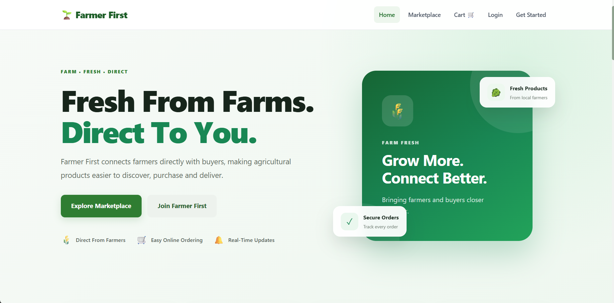
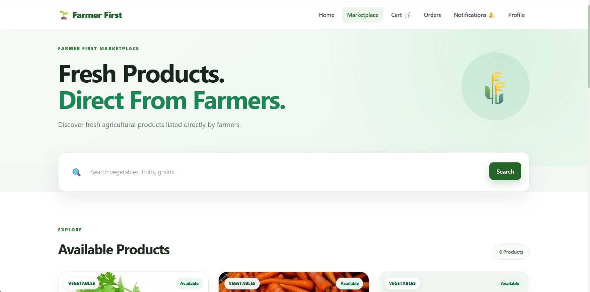
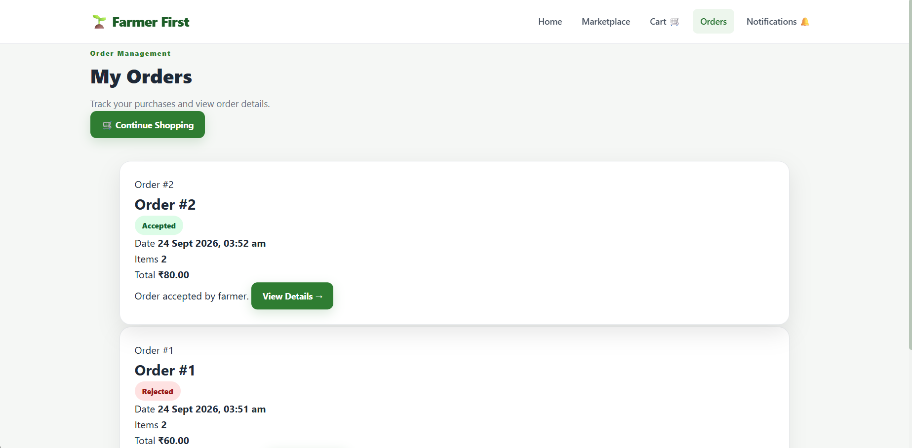

# 🌾 Farmer First — AgriTech Marketplace Platform

**Farmer First** is a full-stack AgriTech marketplace platform that connects **farmers and buyers** through a secure, role-based online marketplace.

Farmers can manage and sell their agricultural products, while buyers can browse products, add items to their cart, place orders, and track their purchases. The platform also includes JWT authentication, role-based authorization, order management, and farmer notifications.

🔗 **Live Demo:** https://farmer-first-eight.vercel.app/
🔗 **GitHub:** https://github.com/Pranav-Masal/farmer-first

---

## 🚀 Features

### 👨‍🌾 Farmer

* Register and login securely
* Manage agricultural products
* Add, update, and delete products
* Manage product prices, descriptions, and stock
* View customer orders
* Receive notifications when a buyer places an order
* Manage farmer-side marketplace activities

### 🛒 Buyer

* Register and login securely
* Browse available agricultural products
* View product details
* Add products to cart
* Update cart quantities
* Remove products from cart
* Place orders
* View order history
* Track order details

### 🔐 Authentication & Authorization

* JWT-based authentication
* Access and refresh tokens
* Role-based access control
* Farmer and Buyer roles
* Protected API endpoints
* Permission-based API access

Example JWT response:

```json
{
  "access": "access_token",
  "refresh": "refresh_token",
  "username": "username",
  "user_role": "Farmer"
}
```

---

## 🛠️ Tech Stack

### Backend

* Python
* Django
* Django REST Framework
* JWT Authentication

### Database

* PostgreSQL

### Frontend

* HTML
* CSS
* JavaScript

### DevOps & Tools

* Docker
* Git
* GitHub
* REST APIs

### API Documentation

* Swagger / OpenAPI
* `/api/docs/`

---

## 🏗️ Project Architecture

```text
                         ┌──────────────────────┐
                         │       Frontend       │
                         │   HTML / CSS / JS    │
                         └──────────┬───────────┘
                                    │
                                    ▼
                         ┌──────────────────────┐
                         │      REST API        │
                         │ Django REST Framework│
                         └──────────┬───────────┘
                                    │
                   ┌────────────────┴────────────────┐
                   │                                 │
                   ▼                                 ▼
          ┌─────────────────┐              ┌─────────────────┐
          │   JWT Auth      │              │ Role Permissions│
          │ Access/Refresh  │              │ Farmer / Buyer  │
          └─────────────────┘              └─────────────────┘
                                    │
                                    ▼
                         ┌──────────────────────┐
                         │     PostgreSQL       │
                         │      Database        │
                         └──────────────────────┘
```

---

## 📦 Core Modules

```text
Authentication
    ├── User Registration
    ├── Login
    ├── JWT Access Token
    ├── JWT Refresh Token
    └── Role Management

Products
    ├── Create Product
    ├── Update Product
    ├── Delete Product
    ├── Product Listing
    └── Product Details

Cart
    ├── Add to Cart
    ├── Update Quantity
    ├── Remove Item
    └── Cart Summary

Orders
    ├── Place Order
    ├── Order History
    ├── Order Details
    └── Farmer Order Notifications
```

---

## 🔑 API Endpoints

The project provides RESTful APIs under the `/api/` namespace.

### Authentication

```text
POST   /api/auth/register/
POST   /api/auth/login/
POST   /api/auth/token/refresh/
```

### Products

```text
GET    /api/products/
POST   /api/products/
GET    /api/products/<id>/
PUT    /api/products/<id>/
DELETE /api/products/<id>/
```

### Cart

```text
GET    /api/cart/
POST   /api/cart/
PUT    /api/cart/<id>/
DELETE /api/cart/<id>/
```

### Orders

```text
GET    /api/orders/
POST   /api/orders/
GET    /api/orders/<id>/
```

> **Note:** Exact endpoint availability may depend on the current API implementation.

---

## 📚 API Documentation

Interactive API documentation is available through Swagger/OpenAPI.

```text
/api/docs/
```

This allows developers to:

* Explore available endpoints
* View request and response formats
* Test APIs
* Understand authentication requirements
* Test protected endpoints using JWT

---

## 🔒 Security

Farmer First uses several security mechanisms:

* JWT authentication
* Access and refresh token system
* Role-based authorization
* Protected API endpoints
* Farmer-specific permission guards
* Secure password handling through Django authentication

Example role guard concept:

```text
User
 │
 ├── Farmer
 │     └── Manage Products
 │
 └── Buyer
       └── Browse / Cart / Orders
```

---

## 🐳 Running with Docker

Clone the repository:

```bash
git clone https://github.com/Pranav-Masal/farmer-first.git
```

Navigate to the project:

```bash
cd farmer-first
```

Build and start the containers:

```bash
docker compose up --build
```

After the application starts, open the configured local URL in your browser.

---

## 💻 Local Development

### 1. Clone the repository

```bash
git clone https://github.com/Pranav-Masal/farmer-first.git
cd farmer-first
```

### 2. Create a virtual environment

```bash
python -m venv venv
```

Activate it on Windows:

```powershell
venv\Scripts\activate
```

On macOS/Linux:

```bash
source venv/bin/activate
```

### 3. Install dependencies

```bash
pip install -r requirements.txt
```

### 4. Configure environment variables

Create a `.env` file and configure the required database and authentication settings.

Example:

```env
SECRET_KEY=your_secret_key
DEBUG=True

DATABASE_NAME=your_database
DATABASE_USER=your_database_user
DATABASE_PASSWORD=your_database_password
DATABASE_HOST=localhost
DATABASE_PORT=5432
```

> Never commit your real `.env` file or secret keys to GitHub.

### 5. Run migrations

```bash
python manage.py migrate
```

### 6. Start the development server

```bash
python manage.py runserver
```

Open:

```text
http://127.0.0.1:8000/
```

---

## 📁 Project Structure

```text
farmer-first/
│
├── manage.py
├── requirements.txt
├── Dockerfile
├── docker-compose.yml
├── .gitignore
│
├── project/
│   ├── settings.py
│   ├── urls.py
│   └── ...
│
├── authentication/
│   ├── models.py
│   ├── serializers.py
│   ├── views.py
│   └── urls.py
│
├── products/
│   ├── models.py
│   ├── serializers.py
│   ├── views.py
│   └── urls.py
│
├── cart/
│   ├── models.py
│   ├── serializers.py
│   ├── views.py
│   └── urls.py
│
└── orders/
    ├── models.py
    ├── serializers.py
    ├── views.py
    └── urls.py
```

> Folder names may differ slightly depending on the current repository structure.

---

## 👥 User Roles

| Role         | Capabilities                                              |
| ------------ | --------------------------------------------------------- |
| 👨‍🌾 Farmer | Manage products, view orders, receive order notifications |
| 🛒 Buyer     | Browse products, manage cart, place and view orders       |

---

## 🔄 Application Flow

```text
                 User Registration
                        │
                        ▼
                  JWT Login
                        │
              ┌─────────┴─────────┐
              ▼                   ▼
           Farmer                Buyer
              │                   │
              ▼                   ▼
       Manage Products       Browse Products
              │                   │
              │                   ▼
              │              Add to Cart
              │                   │
              │                   ▼
              │              Place Order
              │                   │
              └──────────┬────────┘
                         ▼
                  Order Created
                         │
                         ▼
               Farmer Notification
```

---

## 🌐 Live Application

Visit the deployed application:

**https://farmer-first-eight.vercel.app/**

---

## 📸 Screenshots

Add project screenshots here to showcase the application UI.

```markdown






```

---

## 🎯 Project Objectives

Farmer First was developed to demonstrate how a real-world marketplace application can be built using Django and Django REST Framework.

The project focuses on:

* Building production-style REST APIs
* Implementing JWT authentication
* Designing role-based authorization
* Working with PostgreSQL
* Managing relational data
* Implementing e-commerce workflows
* Building order management systems
* Connecting frontend applications with REST APIs
* Containerizing applications using Docker

---

## 💡 Key Learning Outcomes

Through this project, I worked with:

* Django REST Framework
* REST API architecture
* JWT authentication
* Role-based access control
* PostgreSQL database design
* CRUD operations
* API documentation
* Docker-based development
* Git and GitHub workflows
* Frontend and backend integration

---

## 🚀 Future Improvements

Potential future enhancements include:

* Online payment integration
* Advanced product search and filtering
* Product reviews and ratings
* Order tracking
* Email notifications
* Farmer analytics dashboard
* Buyer recommendation system
* AI-powered agricultural recommendations
* Cloud-based image storage

---

## 👨‍💻 Author

**Pranav Masal**

B.Tech in Computer Engineering

📍 Pune, Maharashtra, India

* GitHub: https://github.com/Pranav-Masal
* LinkedIn: https://www.linkedin.com/in/pranav-masal/

---

## ⭐ Support

If you find this project useful, consider giving the repository a ⭐ on GitHub.

---

### 📄 License

This project is developed for educational and portfolio purposes.
